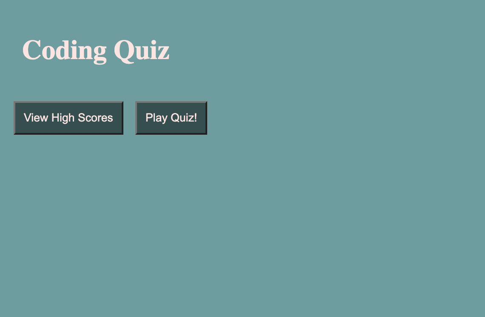
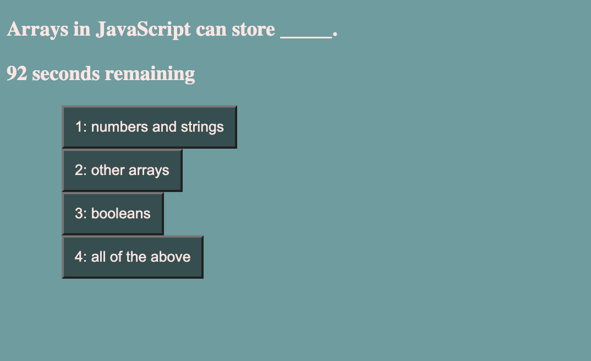
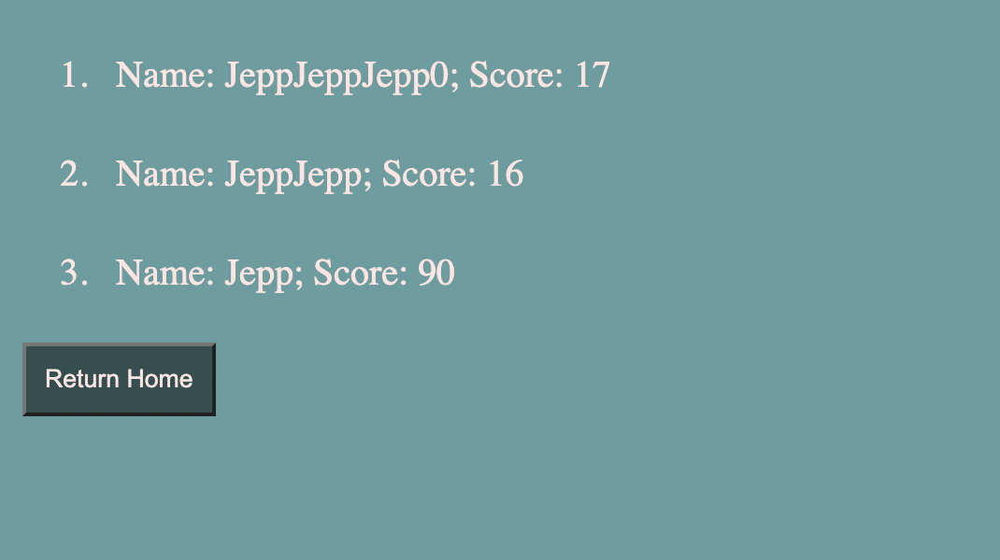

# 04 Web APIs: Code Quiz


# Your Project Title 

## Technology Used 

| Technology Used         | Resource URL           | 
| ------------- |:-------------:| 
| HTML    | [https://developer.mozilla.org/en-US/docs/Web/HTML](https://developer.mozilla.org/en-US/docs/Web/HTML) | 
| JavaScript | [https://developer.mozilla.org/en-US/docs/Web/JavaScript](https://developer.mozilla.org/en-US/docs/Web/JavaScript)|   
| Git | [https://git-scm.com/](https://git-scm.com/)     |    

<hr>

## Description 

[Visit the Deployed Site](https://jeppjeppjepp0.github.io/CodingQuiz/)

This project uses javascript to manage a code quiz by creating and appending elements, as well as editing text content and removing elements. The full requirements of the project are listed below:

```md
GIVEN I am taking a code quiz
WHEN I click the start button
THEN a timer starts and I am presented with a question
WHEN I answer a question
THEN I am presented with another question
WHEN I answer a question incorrectly
THEN time is subtracted from the clock
WHEN all questions are answered or the timer reaches 0
THEN the game is over
WHEN the game is over
THEN I can save my initials and my score
```

<hr>

## Table of Contents


* [Code Sample](#code-sample)
* [Usage](#usage)
* [Learning Points](#learning-points)
* [Author Info](#author-info)

<hr>

## Code Sample

The most important and one of the most frequently used pieces of code is the printQuestion(i) function. This function took in an integer parameter to print the questions stored in the gigantic array to the screen. The following for loop is the section of code that printed the answers into the buttons.

```js
for (var j = 0; j < allQuestions[i].answers.length; j++) {
    // sets button text to answer text
    liArray[j].textContent = (j+1) + ": " + allQuestions[i].answers[j].answersText;
    console.log((j+1) + ": " + allQuestions[i].answers[j].answersText.textContent);
    // console.log(answersUl.children[i]);

    if (allQuestions[i].answers[j].isCorrect) {
        liArray[j].classList.add("correct");
    }
    else {
        liArray[j].classList.add("wrong");
    }

    answersUl.children[j].appendChild(liArray[j]);
}
```

The i variable represents the index of the current question that the user is currently on. The j variable is the index of the answer beneath the question. Each answer has an isCorrect tag to give the button a class that either moves on to the next question or moves on to the next question and loses time (see isCorrect below).

```js
questionText : "Commonly used data types DO NOT INCLUDE:",
answers: [{
    answersText : "strings",
    isCorrect : false
},
{
    answersText : "booleans",
    isCorrect : false
},
{
    answersText : "alerts",
    isCorrect : true
},
{
    answersText : "numbers",
    isCorrect : false
}],
```

<hr>

## Usage 

The user is presented with the home screen and can either choose to play the quiz or view scores.



If the user chooses to play the quiz, they will be presented with a set of 5 questions with 4 options each. If the user chooses incorrectly, they will lose 20 seconds of time.



At the end of the quiz, users will have the opportunity to submit their name to store their score.


Once submitted, the website will store the name and score to be displayed on later visits of the site.



<hr>

## Learning Points 

Below are the following topics/methods that I learned through this project:

 * [setInterva()](https://www.w3schools.com/jsref/met_win_clearinterval.asp)
 * [createElement()](https://www.w3schools.com/jsref/met_document_createelement.asp)
 * [textContent](https://www.w3schools.com/jsref/prop_node_textcontent.asp)
 * [appendChild()](https://www.w3schools.com/jsref/met_node_appendchild.asp)

<hr>

## Author Info


### Jedd Javier

* [LinkedIn](https://www.linkedin.com/in/jedd-javier-4b323426b/)
* [Github](github.com/jeppjeppjepp0)